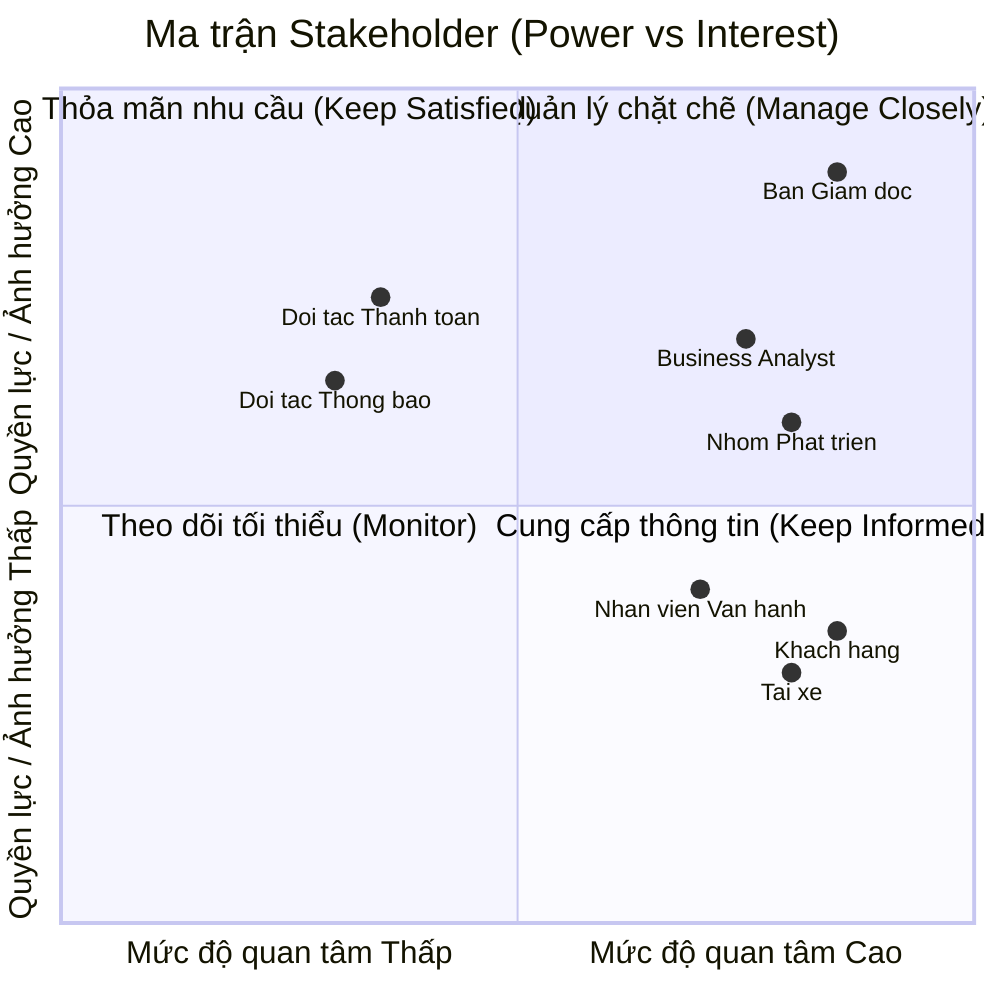

# Software Requirements Specification (SRS) - CAB System

## 1. Stakeholder List & Roles (Danh sách & Vai trò Bên liên quan)

| Stakeholder | Vai trò chính |
| :--- | :--- |
| **Ban Giám đốc** | Ra quyết định chiến lược, duyệt ngân sách và phê duyệt các quy tắc nghiệp vụ. |
| **Khách hàng** | Đặt xe, theo dõi chuyến đi, thanh toán và đánh giá chất lượng dịch vụ. |
| **Tài xế** | Bật trạng thái sẵn sàng, nhận/từ chối chuyến và cập nhật tiến trình chuyến đi. |
| **Nhân viên vận hành** | Theo dõi hệ thống, hỗ trợ xử lý sự cố chuyến đi và quản trị dữ liệu. |
| **Business Analyst (BA)** | Làm rõ yêu cầu chưa chốt và chi tiết hóa quy trình nghiệp vụ cho team. |
| **Nhóm Phát triển (Dev/QA)** | Thiết kế kiến trúc, lập trình và hoàn thiện hệ thống trong 7 tuần. |
| **Đối tác Thanh toán & Thông báo** | Tích hợp xử lý giao dịch điện tử và gửi thông báo tức thì đến người dùng. |

---

## 2. Stakeholder Matrix (Ma trận Bên liên quan)

---

## 3. Business Goals (Mục tiêu Kinh doanh)

* **BG01:** Tự động hóa quy trình phân công tài xế và tối ưu hóa vận hành nhằm giảm thiểu sự can thiệp thủ công, sẵn sàng mở rộng quy mô hệ thống phục vụ lượng lớn khách hàng và tài xế trong tương lai.
* **BG0c:** Nâng cao doanh thu, tỷ lệ hoàn thành chuyến đi và giảm tỷ lệ hủy chuyến thông qua việc tối ưu cơ chế đề xuất, ghép nối tài xế gần nhất theo thời gian thực.
* **BG03:** Tăng cường trải nghiệm và độ hài lòng của khách hàng bằng việc minh bạch hóa thông tin trạng thái chuyến đi, vị trí tài xế, thời gian dự kiến đến và đa dạng hóa phương thức thanh toán an toàn.
* **BG04:** Tăng hiệu quả hoạt động và thu nhập cho tài xế nhờ cơ chế thông báo nhận chuyến chủ động, minh bạch tiến trình chuyến đi và quy trình hỗ trợ vận hành rõ ràng.
* **BG05:** Nâng cao năng lực quản trị, hỗ trợ và xử lý sự cố kịp thời thông qua hệ thống theo dõi trực quan, phân quyền chặt chẽ và công cụ báo cáo hoạt động chuyên sâu.
* **BG06:** Xây dựng kiến trúc nền tảng ổn định, bảo mật cao, có khả năng mở rộng độc lập và linh hoạt tích hợp/bổ sung các loại hình dịch vụ, đối tác thanh toán hay thông báo mới trong tương lai mà không ảnh hưởng tới hệ thống đang chạy.

---

## 4. Minimum Viable Product (MVP) Modules

1. **Module Quản lý Tài khoản & Định danh (Account & Auth Module):** Đăng ký, đăng nhập, quản lý hồ sơ (Khách hàng, Tài xế) và phân quyền quản trị (Nhân viên vận hành).
2. **Module Đặt xe & Phân công (Booking & Matching Module):** Tạo chuyến, định vị thời gian thực, thuật toán tự động ghép nối/tìm tài xế gần nhất và xử lý chuyển tiếp khi từ chối.
3. **Module Quản lý Tiến trình Chuyến đi (Trip Management Module):** Cập nhật/theo dõi trạng thái chuyến đi theo thời gian thực (ETA, vị trí), lịch sử chuyến và đánh giá tài xế.
4. **Module Tính cước & Thanh toán (Pricing & Payment Module):** Tính tiền tự động, hỗ trợ tiền mặt và tích hợp Payment Gateway bên ngoài xử lý thanh toán điện tử.
5. **Module Thông báo (Notification Module):** Gửi thông báo tức thì cho Khách hàng/Tài xế theo từng sự kiện của chuyến đi.
6. **Module Vận hành & Báo cáo (Admin & Analytics Module):** Giao diện quản trị theo dõi chuyến đi, hỗ trợ xử lý sự cố và xuất báo cáo doanh thu, hiệu suất cho Ban giám đốc.

## 5. Business Requirements

ID	Business Requirement	Mô tả
BR01	Quản lý tài khoản và người dùng	Hệ thống phải hỗ trợ quản lý tài khoản của Khách hàng, Tài xế và Nhân viên vận hành, đồng thời phân quyền theo từng vai trò.
BR02	Quản lý đặt xe	Hệ thống phải cho phép Khách hàng tạo yêu cầu đặt xe với thông tin điểm đón, điểm đến và phương thức thanh toán.
BR03	Tự động phân công tài xế	Hệ thống phải tự động tìm kiếm và đề xuất Tài xế phù hợp dựa trên vị trí và trạng thái sẵn sàng, ưu tiên Tài xế gần Khách hàng.
BR04	Xử lý từ chối chuyến	Khi Tài xế từ chối hoặc không phản hồi yêu cầu chuyến đi, hệ thống phải chuyển yêu cầu sang Tài xế phù hợp tiếp theo.
BR05	Quản lý tiến trình chuyến đi	Hệ thống phải cho phép Khách hàng và Nhân viên vận hành theo dõi trạng thái chuyến đi từ lúc đặt xe đến khi hoàn thành hoặc hủy chuyến.
BR06	Theo dõi vị trí và ETA	Hệ thống phải cung cấp vị trí hiện tại của Tài xế và thời gian dự kiến đến (ETA) cho Khách hàng trong quá trình đón khách.
BR07	Tính cước chuyến đi	Hệ thống phải tự động tính giá chuyến đi dựa trên các quy tắc tính cước được doanh nghiệp thiết lập.
BR08	Quản lý thanh toán	Hệ thống phải hỗ trợ thanh toán bằng tiền mặt và thanh toán điện tử thông qua Payment Gateway.
BR09	Thông báo sự kiện	Hệ thống phải gửi thông báo kịp thời đến Khách hàng và Tài xế khi có các sự kiện quan trọng như nhận chuyến, tài xế đến, chuyến bắt đầu, hoàn thành hoặc hủy.
BR10	Đánh giá dịch vụ	Hệ thống phải cho phép Khách hàng đánh giá chất lượng chuyến đi và Tài xế sau khi hoàn thành chuyến.
BR11	Quản lý lịch sử chuyến đi	Hệ thống phải lưu trữ và cho phép tra cứu lịch sử đặt xe, chuyến đi và thanh toán của Khách hàng.
BR12	Giám sát và hỗ trợ vận hành	Nhân viên vận hành phải có khả năng theo dõi các chuyến đi đang hoạt động, phát hiện và hỗ trợ xử lý các sự cố phát sinh.
BR13	Quản lý dữ liệu và phân quyền	Hệ thống phải đảm bảo dữ liệu được quản lý tập trung và người dùng chỉ được truy cập các chức năng, dữ liệu phù hợp với vai trò.
BR14	Báo cáo kinh doanh	Hệ thống phải cung cấp báo cáo về doanh thu, số lượng chuyến, tỷ lệ hoàn thành, tỷ lệ hủy và hiệu suất hoạt động của Tài xế.
BR15	Đảm bảo khả năng mở rộng	Hệ thống phải được thiết kế để có thể mở rộng số lượng Khách hàng, Tài xế và chuyến đi mà không ảnh hưởng đáng kể đến hoạt động hiện tại.
BR16	Tích hợp đối tác bên ngoài	Hệ thống phải hỗ trợ tích hợp với các đối tác thanh toán và thông báo để phục vụ hoạt động kinh doanh.
