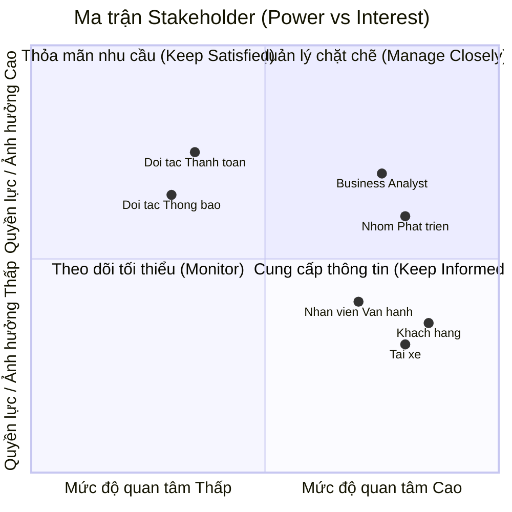
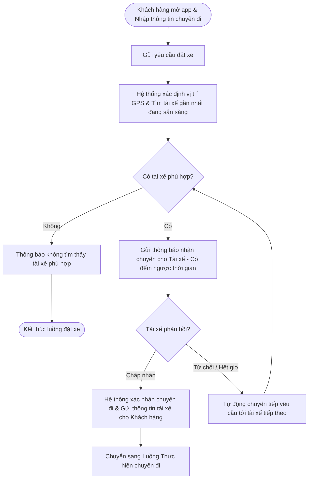
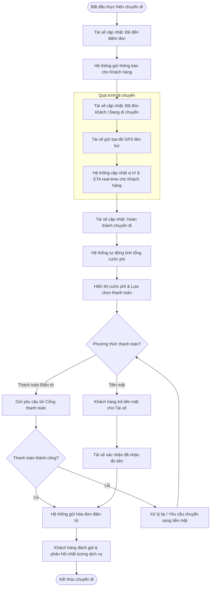
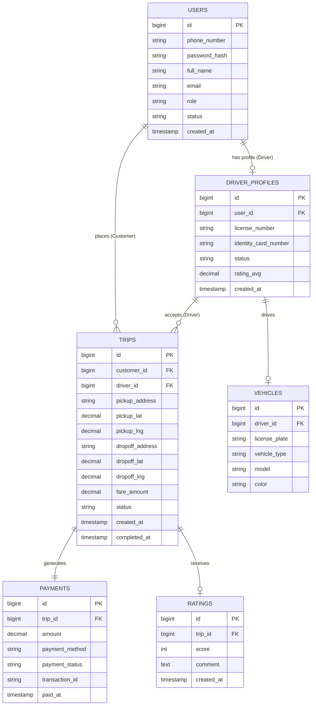
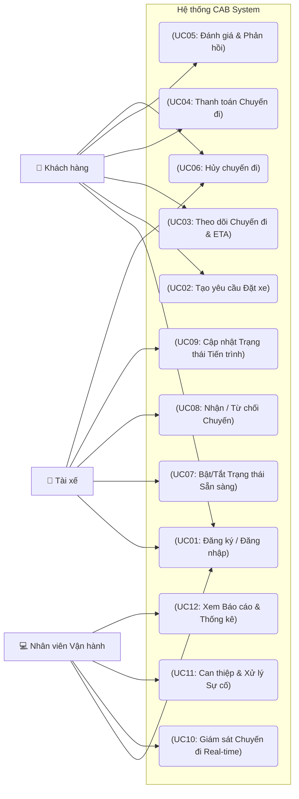

# Software Requirements Specification (SRS) - CAB System

## 1. Stakeholder List & Roles (Danh sách & Vai trò Bên liên quan)

| Stakeholder | Vai trò chính |
| :--- | :--- |
| **Khách hàng** | Đặt xe, theo dõi chuyến đi, thanh toán và đánh giá chất lượng dịch vụ. |
| **Tài xế** | Bật trạng thái sẵn sàng, nhận/từ chối chuyến và cập nhật tiến trình chuyến đi. |
| **Nhân viên vận hành** | Theo dõi hệ thống, hỗ trợ xử lý sự cố chuyến đi và quản trị dữ liệu. |
| **Business Analyst (BA)** | Làm rõ yêu cầu chưa chốt và chi tiết hóa quy trình nghiệp vụ cho team. |
| **Nhóm Phát triển (Dev/QA)** | Thiết kế kiến trúc, lập trình và hoàn thiện hệ thống trong 7 tuần. |
| **Đối tác Thanh toán & Thông báo** | Tích hợp xử lý giao dịch điện tử và gửi thông báo tức thì đến người dùng. |

---

## 2. Stakeholder Matrix (Ma trận Bên liên quan)

---

## 3. Business Goals (Mục tiêu Kinh doanh)

* **BG01:** Tự động hóa quy trình phân công tài xế và tối ưu hóa vận hành nhằm giảm thiểu sự can thiệp thủ công, sẵn sàng mở rộng quy mô hệ thống phục vụ lượng lớn khách hàng và tài xế trong tương lai.
* **BG02:** Nâng cao doanh thu, tỷ lệ hoàn thành chuyến đi và giảm tỷ lệ hủy chuyến thông qua việc tối ưu cơ chế đề xuất, ghép nối tài xế gần nhất theo thời gian thực.
* **BG03:** Tăng cường trải nghiệm và độ hài lòng của khách hàng bằng việc minh bạch hóa thông tin trạng thái chuyến đi, vị trí tài xế, thời gian dự kiến đến và đa dạng hóa phương thức thanh toán an toàn.
* **BG04:** Tăng hiệu quả hoạt động và thu nhập cho tài xế nhờ cơ chế thông báo nhận chuyến chủ động, minh bạch tiến trình chuyến đi và quy trình hỗ trợ vận hành rõ ràng.
* **BG05:** Nâng cao năng lực quản trị, hỗ trợ và xử lý sự cố kịp thời thông qua hệ thống theo dõi trực quan, phân quyền chặt chẽ và công cụ báo cáo hoạt động chuyên sâu.
* **BG06:** Xây dựng kiến trúc nền tảng ổn định, bảo mật cao, có khả năng mở rộng độc lập và linh hoạt tích hợp/bổ sung các loại hình dịch vụ, đối tác thanh toán hay thông báo mới trong tương lai mà không ảnh hưởng tới hệ thống đang chạy.

---

## 4. Minimum Viable Product (MVP) Modules

1. **Module Quản lý Tài khoản & Định danh (Account & Auth Module):** Đăng ký, đăng nhập, quản lý hồ sơ (Khách hàng, Tài xế) và phân quyền quản trị (Nhân viên vận hành).
2. **Module Đặt xe & Phân công (Booking & Matching Module):** Tạo chuyến, định vị thời gian thực, thuật toán tự động ghép nối/tìm tài xế gần nhất và xử lý chuyển tiếp khi từ chối.
3. **Module Quản lý Tiến trình Chuyến đi (Trip Management Module):** Cập nhật/theo dõi trạng thái chuyến đi theo thời gian thực (ETA, vị trí), lịch sử chuyến và đánh giá tài xế.
4. **Module Tính cước & Thanh toán (Pricing & Payment Module):** Tính tiền tự động, hỗ trợ tiền mặt và tích hợp Payment Gateway bên ngoài xử lý thanh toán điện tử.
5. **Module Thông báo (Notification Module):** Gửi thông báo tức thì cho Khách hàng/Tài xế theo từng sự kiện của chuyến đi.
6. **Module Vận hành & Báo cáo (Admin & Analytics Module):** Giao diện quản trị theo dõi chuyến đi, hỗ trợ xử lý sự cố và xuất báo cáo doanh thu, hiệu suất cho Ban giám đốc.

## 5. Business Requirements (Yêu Cầu Nghiệp Vụ)

| ID | Tên Yêu cầu | Mô tả Chi tiết |
| --- | --- | --- |
| **BR01** | Đăng ký & Quản lý Khách hàng | Hệ thống hỗ trợ Khách hàng đăng ký tài khoản, đăng nhập, cập nhật thông tin cá nhân và xem lịch sử các chuyến đi đã thực hiện. |
| **BR02** | Đăng ký & Quản lý Tài xế | Hệ thống hỗ trợ Tài xế đăng ký tài khoản (hoặc được tạo bởi Nhân viên vận hành), cập nhật hồ sơ, thông tin phương tiện và bật/tắt trạng thái sẵn sàng làm việc.|
| **BR03** | Tạo yêu cầu Đặt xe | Hệ thống cho phép Khách hàng nhập điểm đón, điểm đến, lựa chọn loại dịch vụ/loại xe và gửi yêu cầu đặt xe.|
| **BR04** | Định vị & Đề xuất Tài xế | Hệ thống ghi nhận vị trí GPS theo thời gian thực của Tài xế để tìm kiếm và đề xuất chuyến đi dựa trên độ gần và trạng thái sẵn sàng.|
| **BR05** | Tự động Chuyển tiếp Điều phối | Hệ thống hỗ trợ chuyển tiếp tìm kiếm Tài xế tiếp theo nếu Tài xế được đề xuất ban đầu từ chối hoặc không phản hồi, đảm bảo không yêu cầu Khách hàng đặt lại chuyến.|
| **BR06** | Thông báo Không tìm thấy Tài xế | Hệ thống thông báo rõ ràng cho Khách hàng trong trường hợp không tìm được Tài xế phù hợp.|
| **BR07** | Tiếp nhận Chuyến đi | Hệ thống hỗ trợ Tài xế nhận thông báo và lựa chọn chấp nhận hoặc từ chối yêu cầu chuyến đi.|
| **BR08** | Cập nhật Tiến trình Chuyến đi | Hệ thống cho phép Tài xế cập nhật liên tục tiến trình chuyến đi (*Đã đến điểm đón*, *Đã đón khách*, *Đang di chuyển*, *Hoàn thành*).|
| **BR09** | Theo dõi Real-time & ETA | Hệ thống hiển thị thời gian dự kiến đến (ETA), vị trí Tài xế và trạng thái chuyến đi theo thời gian thực cho Khách hàng theo dõi.|
| **BR10** | Tự động Tính cước | Hệ thống tự động tính toán số tiền cước sau khi chuyến đi hoàn thành dựa trên loại dịch vụ và thông tin chuyến đi.|
| **BR11** | Tích hợp Thanh toán | Hệ thống hỗ trợ thanh toán bằng tiền mặt và tích hợp với cổng thanh toán điện tử bên ngoài (Payment Gateway), đảm bảo không lưu thông tin thẻ/tài khoản nhạy cảm trên hệ thống CAB.|
| **BR12** | Xử lý Lỗi Thanh toán | Hệ thống hỗ trợ xử lý lại giao dịch và thông báo cho Khách hàng khi thanh toán điện tử bị thất bại.|
| **BR13** | Thông báo Tức thời Đa kênh | Hệ thống tự động gửi thông báo (Push/SMS) cho Khách hàng và Tài xế tại các mốc: tiếp nhận chuyến, tài xế nhận chuyến, tài xế tới điểm đón, chuyến hoàn thành và kết quả thanh toán.|
| **BR14** | Giám sát & Hỗ trợ Vận hành | Hệ thống cung cấp giao diện quản trị cho Nhân viên vận hành để giám sát danh sách chuyến đi đang diễn ra, kiểm tra trạng thái Tài xế, tra cứu lịch sử giao dịch và can thiệp xử lý chuyến lỗi.|
| **BR15** | Phân quyền Quản trị | Hệ thống áp dụng cơ chế phân quyền truy cập chặt chẽ để hạn chế Nhân viên vận hành thông thường thực hiện các thao tác quản trị nhạy cảm.|
| **BR16** | Báo cáo Thống kê Quản trị | Hệ thống cung cấp báo cáo thống kê cho Ban Giám đốc về tổng số chuyến, doanh thu, tỷ lệ hoàn thành/hủy chuyến và hiệu quả hoạt động của Tài xế.|
| **BR17** | Đánh giá Dịch vụ | Hệ thống cho phép Khách hàng thực hiện đánh giá (rating/comment) chất lượng Tài xế sau khi hoàn thành chuyến đi.|

## 6. Business Process Modeling (Mô hình hóa Quy trình Nghiệp vụ)

### 6.1. Luồng Đặt xe & Điều phối Tự động

### 6.2. Quy trình Thực hiện Chuyến đi & Thanh toán

## 7. Functional Requirements

| ID | Tên Yêu cầu | Mô tả Chi tiết |
| --- | --- | --- |
| **FR01** | Đăng ký & Đăng nhập | Hệ thống cho phép Khách hàng và Tài xế đăng ký tài khoản, đăng nhập, đăng xuất và cập nhật thông tin cá nhân. |
| **FR02** | Quản lý Tài xế | Hệ thống cho phép Tài xế cập nhật thông tin hồ sơ, phương tiện và bật/tắt trạng thái sẵn sàng nhận chuyến. |
| **FR03** | Tạo yêu cầu Đặt xe | Hệ thống cho phép Khách hàng nhập điểm đón, điểm đến, lựa chọn loại dịch vụ/loại xe và gửi yêu cầu đặt xe. |
| **FR04** | Xác định Vị trí | Hệ thống thu thập và cập nhật vị trí GPS của Khách hàng và Tài xế để phục vụ việc đặt xe và theo dõi chuyến đi. |
| **FR05** | Tìm kiếm Tài xế | Hệ thống tự động tìm kiếm Tài xế đang sẵn sàng và phù hợp với yêu cầu chuyến đi dựa trên vị trí và trạng thái hoạt động. |
| **FR06** | Gửi yêu cầu nhận chuyến | Hệ thống gửi thông báo yêu cầu nhận chuyến đến Tài xế phù hợp và hiển thị thời gian chờ phản hồi. |
| **FR07** | Xử lý phản hồi Tài xế | Hệ thống ghi nhận lựa chọn chấp nhận hoặc từ chối chuyến đi của Tài xế. |
| **FR08** | Tự động chuyển tiếp chuyến | Khi Tài xế từ chối hoặc không phản hồi trong thời gian quy định, hệ thống tự động chuyển yêu cầu đến Tài xế phù hợp tiếp theo. |
| **FR09** | Xác nhận Chuyến đi | Khi Tài xế chấp nhận, hệ thống xác nhận chuyến đi và gửi thông tin Tài xế cho Khách hàng. |
| **FR10** | Cập nhật Trạng thái chuyến | Hệ thống cho phép Tài xế cập nhật trạng thái chuyến đi gồm: Đã đến điểm đón, Đã đón khách, Đang di chuyển và Hoàn thành. |
| **FR11** | Theo dõi Chuyến đi | Hệ thống hiển thị vị trí Tài xế, trạng thái chuyến đi và ETA theo thời gian thực cho Khách hàng. |
| **FR12** | Tính Cước phí | Hệ thống tự động tính tổng cước phí dựa trên loại dịch vụ và thông tin thực tế của chuyến đi. |
| **FR13** | Thanh toán | Hệ thống hỗ trợ Khách hàng thanh toán bằng tiền mặt hoặc thanh toán điện tử thông qua Payment Gateway. |
| **FR14** | Xử lý Thanh toán thất bại | Hệ thống thông báo kết quả giao dịch và cho phép thực hiện lại thanh toán hoặc chuyển sang phương thức tiền mặt khi giao dịch điện tử thất bại. |
| **FR15** | Gửi Thông báo | Hệ thống tự động gửi Push/SMS thông báo cho Khách hàng và Tài xế tại các sự kiện quan trọng của chuyến đi. |
| **FR16** | Đánh giá Dịch vụ | Hệ thống cho phép Khách hàng đánh giá và gửi nhận xét về chất lượng Tài xế sau khi chuyến đi hoàn thành. |
| **FR17** | Quản lý Lịch sử | Hệ thống lưu trữ và cho phép Khách hàng xem lịch sử chuyến đi, thông tin thanh toán và đánh giá. |
| **FR18** | Giám sát Vận hành | Hệ thống cung cấp giao diện cho Nhân viên vận hành theo dõi các chuyến đang diễn ra, trạng thái Tài xế và xử lý các chuyến gặp sự cố. |
| **FR19** | Báo cáo & Thống kê | Hệ thống cung cấp báo cáo về số lượng chuyến, doanh thu, tỷ lệ hoàn thành/hủy chuyến và hiệu suất Tài xế. |
| **FR20** | Phân quyền & Ghi Log | Hệ thống kiểm soát quyền truy cập theo vai trò và ghi nhận các thao tác quan trọng liên quan đến tài khoản, chuyến đi và thanh toán. |

## 8. Business Rules
| ID | Tên Rule | Mô tả Chi tiết |
| --- | --- | --- |
| **BRULE01** | Trạng thái Tài xế | Tài xế chỉ được nhận chuyến khi đang ở trạng thái **Sẵn sàng (Available/Ready)**. |
| **BRULE02** | Phân công Chuyến đi | Mỗi chuyến đi chỉ được phân công cho **một Tài xế tại một thời điểm**. |
| **BRULE03** | Từ chối Chuyến đi | Khi Tài xế từ chối hoặc không phản hồi trong thời gian quy định, hệ thống phải tự động tìm và gửi yêu cầu cho Tài xế phù hợp tiếp theo. |
| **BRULE04** | Tài xế đang thực hiện chuyến | Tài xế đang thực hiện một chuyến đi không được nhận thêm chuyến mới. |
| **BRULE05** | Tính Cước phí | Cước phí phải được hệ thống tự động tính dựa trên **loại dịch vụ, quãng đường và các quy tắc giá hiện hành**. |
| **BRULE06** | Hoàn thành Chuyến đi | Chuyến đi chỉ được chuyển sang trạng thái **Hoàn thành** khi Tài xế xác nhận đã kết thúc chuyến. |
| **BRULE07** | Thanh toán Điện tử | Giao dịch thanh toán điện tử chỉ được ghi nhận là **thành công** khi Payment Gateway xác nhận giao dịch thành công. |
| **BRULE08** | Thanh toán Tiền mặt | Với phương thức tiền mặt, Tài xế phải xác nhận đã nhận đủ số tiền trước khi hệ thống ghi nhận thanh toán hoàn tất. |
| **BRULE09** | Đánh giá Chuyến đi | Khách hàng chỉ được đánh giá chuyến đi sau khi chuyến đi đã hoàn thành và mỗi chuyến chỉ được đánh giá một lần. |
| **BRULE10** | Phân quyền Người dùng | Mỗi người dùng chỉ được thực hiện các chức năng tương ứng với vai trò được cấp: **Customer, Driver hoặc Operator**. |
| **BRULE11** | Quản trị Hệ thống | Chỉ Nhân viên vận hành có quyền phù hợp mới được thực hiện các thao tác quản trị và xử lý sự cố chuyến đi. |
| **BRULE12** | Ghi nhận Thay đổi | Các thay đổi quan trọng liên quan đến tài khoản, chuyến đi và thanh toán phải được hệ thống ghi log để phục vụ kiểm tra và truy vết. |
| **BRULE13** | Thông báo Chuyến đi | Hệ thống phải gửi thông báo đến Khách hàng và Tài xế khi xảy ra các sự kiện quan trọng trong quá trình đặt và thực hiện chuyến đi. |
| **BRULE14** | Không tìm thấy Tài xế | Nếu không còn Tài xế phù hợp, hệ thống phải thông báo cho Khách hàng và kết thúc yêu cầu đặt xe. |
| **BRULE15** | Hủy Chuyến đi | Việc hủy chuyến phải được kiểm tra theo trạng thái hiện tại của chuyến và các quy định hủy chuyến của hệ thống. |

## 9. Non-Functional Requirements (Yêu cầu Phi chức năng)

| ID | Nhóm Yêu cầu | Tiêu chí & Thông số Kỹ thuật |
| :--- | :--- | :--- |
| **NFR01** | **Hiệu năng (Performance)** | • Thời gian phản hồi API < **200ms** cho 95% các tác vụ thông thường. • Thời gian tìm kiếm và đề xuất tài xế gần nhất < **2 giây**. • Độ trễ cập nhật vị trí GPS real-time trên bản đồ từ **3 - 5 giây**. |
| **NFR02** | **Bảo mật (Security)** | • Mã hóa toàn bộ dữ liệu truyền tải qua **HTTPS/TLS 1.3**. • Xác thực và phân quyền truy cập thông qua **JWT (JSON Web Token)** & OAuth 2.0. • Mã hóa mật khẩu người dùng bằng thuật toán bcrypt/Argon2. • Tuân thủ tiêu chuẩn PCI-DSS (không lưu trữ thông tin thẻ thanh toán nhạy cảm trên hệ thống CAB). |
| **NFR03** | **Độ tin cậy & Khả dụng (Availability)** | • Thời gian hoạt động của hệ thống (Uptime) đạt tối thiểu **99.9%** (24/7/365). • Tự động sao lưu (Backup) cơ sở dữ liệu định kỳ 1 lần/ngày và lưu trữ tối thiểu 30 ngày. |
| **NFR04** | **Khả năng mở rộng (Scalability)** | • Kiến trúc Microservices/Modular Monolith hỗ trợ mở rộng chiều ngang (Horizontal Scaling). • Đáp ứng tối thiểu **10,000 người dùng hoạt động đồng thời (DAU)** và xử lý **1,000 chuyến đi/phút** trong giờ cao điểm mà không gây gián đoạn. |
| **NFR05** | **Tính Dễ sử dụng (Usability)** | • Giao diện di động tối ưu cho thao tác 1 tay, thân thiện trên cả 2 nền tảng iOS và Android. • Hiển thị thông báo trạng thái rõ ràng, hỗ trợ ngôn ngữ Tiếng Việt và Tiếng Anh. |

---
## 10. Data modeling 
**Mô hình Dữ liệu ERD**

---

## 11. Use Cases 
*** Use Case Diagram

---
## 12. Acceptance Criteria (Tiêu chí Chấp nhận - AC)

### 12.1. Bảng Tiêu chí Chấp nhận theo Module

| AC ID | Feature / Use Case | Given (Điều kiện tiên quyết) | When (Hành động kích hoạt) | Then (Kết quả kỳ vọng) |
| :--- | :--- | :--- | :--- | :--- |
| **AC01** | Đặt xe & Phân công (Booking) | Khách hàng nhập đủ Điểm đón, Điểm đến, Phương thức thanh toán hợp lệ. | Khách hàng nhấn nút **"Đặt xe"**. | • Chuyến đi tạo ở trạng thái `PENDING`. • Gửi đề xuất tới Tài xế gần nhất trong bán kính 3km (đếm ngược 15s). • Khi Tài xế bấm "Chấp nhận", chuyến đổi sang `ACCEPTED`, hiển thị thông tin Tài xế cho Khách. |
| **AC02** | Xử lý Timeout Tài xế (Matching Timeout) | Tài xế nhận thông báo đề xuất chuyến kèm đồng hồ đếm ngược 15 giây. | Tài xế không thao tác (Chấp nhận/Từ chối) sau **15 giây**. | • Hệ thống ghi nhận "Từ chối do Timeout". • Tự động chuyển tiếp yêu cầu đặt xe tới Tài xế tiếp theo. • Tài xế cũ không nhận lại thông báo cho chính chuyến đi đó trong lượt tìm kiếm này. |
| **AC03** | Khách hàng Hủy chuyến (Cancel Booking) | Chuyến đi ở trạng thái `ACCEPTED` (Tài xế đang đến đón) < 2 phút. | Khách hàng nhấn nút **"Hủy chuyến"** và chọn lý do. | • Trạng thái chuyến chuyển sang `CANCELLED`. • Miễn phí phạt hủy chuyến. • Gửi Push Notification thông báo Khách đã hủy chuyến tới App Tài xế. |
| **AC04** | Theo dõi Real-time & ETA | Chuyến đi ở trạng thái `IN_PROGRESS` (Đang di chuyển). | App Tài xế gửi tọa độ GPS định kỳ mỗi **3 - 5 giây**. | • Biểu tượng xe Tài xế di chuyển mượt mà trên bản đồ App Khách hàng. • Thời gian dự kiến đến (ETA) và khoảng cách tự động tính toán & cập nhật liên tục. |
| **AC05** | Thanh toán Điện tử (E-Payment) | Chuyến đi hoàn thành, Khách hàng chọn phương thức thanh toán "Ví điện tử". | Tài xế nhấn **"Hoàn thành chuyến đi"**. | • Hệ thống tự động trừ tiền qua Cổng thanh toán. • Khi trả về `SUCCESS`, chuyến chuyển sang `COMPLETED`, `payment_status` = `SUCCESS`. • Xuất Hóa đơn điện tử gửi về App Khách và thông báo "Đã nhận tiền" cho Tài xế. |
| **AC06** | Xử lý Thanh toán Lỗi (Payment Failure) | Khách hàng chọn Ví điện tử nhưng tài khoản không đủ số dư hoặc lỗi kết nối. | Cổng thanh toán trả về kết quả `FAILED`. | • Hệ thống hiển thị thông báo lỗi thanh toán trên App Khách hàng. • Cho phép Khách chọn phương thức thay thế (*Chuyển sang Tiền mặt* hoặc *Ví khác*). • Chuyển trạng thái `COMPLETED` chỉ sau khi xác nhận thanh toán thành công. |
| **AC07** | Can thiệp Hủy chuyến kẹt (Admin Intervention) | Chuyến đi bị rớt kết nối GPS > 3 phút, hiển thị cảnh báo trên màn hình Admin. | Nhân viên vận hành chọn chuyến đi, nhập lý do và nhấn **"Hủy chuyến thủ công"**. | • Trạng thái chuyến chuyển lập tức sang `CANCELLED`. • Giải phóng trạng thái cho Khách hàng để đặt chuyến mới. • Tự động lưu chi tiết hành động can thiệp vào `Audit Log`. |

## 13. Traceability Matrix (Bảng Truy vết Nghiệp vụ & Kỹ thuật)

| Mã BG | Tên Mục tiêu Kinh doanh | Mã BR | Mã Module | Mã FR | Mã UC | Mã AC |
| :--- | :--- | :--- | :--- | :--- | :--- | :--- |
| **BG01** | Tự động hóa & Mở rộng Vận hành | **BR02** | **MOD02** | **FR02.2** | UC02 | **AC-FR02.2** |
| | | | | **FR02.4** | UC08 | **AC-FR02.4** |
| **BG02** | Tối ưu Doanh thu & Chuyến đi | **BR02** | **MOD02** | **FR02.1** | UC02 | **AC-FR02.1** |
| | | | | **FR02.3** | UC08 | **AC-FR02.3** |
| | | **BR03** | **MOD03** | **FR03.3** | UC06 | **AC-FR03.3** |
| **BG03** | Nâng cao Trải nghiệm Khách hàng | **BR03** | **MOD03** | **FR03.1** | UC09 | **AC-FR03.1** |
| | | | | **FR03.2** | UC03 | **AC-FR03.2** |
| | | | | **FR03.4** | UC03 | **AC-FR03.4** |
| | | **BR04** | **MOD04** | **FR04.3** | UC04 | **AC-FR04.3** |
| | | | | **FR04.4** | UC04 | **AC-FR04.4** |
| **BG04** | Tối ưu Hiệu quả cho Tài xế | **BR01** | **MOD01** | **FR01.3** | UC01 | **AC-FR01.3** |
| | | **BR02** | **MOD02** | **FR02.3** | UC07, UC08 | **AC-FR02.3** |
| | | **BR04** | **MOD04** | **FR04.1** | UC09 | **AC-FR04.1** |
| | | | | **FR04.2** | UC04 | **AC-FR04.2** |
| **BG05** | Nâng cao Năng lực Quản trị | **BR01** | **MOD01** | **FR01.4** | UC01 | **AC-FR01.4** |
| | | **BR05** | **MOD06** | **FR06.1** | UC10 | **AC-FR06.1** |
| | | | | **FR06.2** | UC11 | **AC-FR06.2** |
| | | **BR06** | **MOD06** | **FR06.3** | UC12 | **AC-FR06.3** |
| | | | | **FR06.4** | UC05 | **AC-FR06.4** |
| **BG06** | Kiến trúc Nền tảng Linh hoạt | **BR01** | **MOD01** | **FR01.1** | UC01 | **AC-FR01.1** |
| | | | | **FR01.2** | UC01 | **AC-FR01.2** |
| | | **BR04** | **MOD05** | **FR05.1** | UC03, UC09 | **AC-FR05.1** |
| | | | | **FR05.2** | UC01 | **AC-FR05.2** |

## 14. Test Cases

| Test Case ID | Test Scenario | Test Case | Preconditions | Test Steps | Test Data | Expected Result | Priority |
|---|---|---|---|---|---|---|---|
| TC_AUTH_001 | Kiểm tra chức năng đăng nhập | **[POS]** Đăng nhập với thông tin hợp lệ | User đã đăng ký tài khoản và đang ở màn hình Login | 1. Mở Login 2. Nhập email 3. Nhập password 4. Nhấn Login | Email: `customer01@gmail.com` Password: `Customer@123` | Đăng nhập thành công và hệ thống trả về JWT Token | High |
| TC_AUTH_002 | Kiểm tra chức năng đăng ký | **[POS]** Đăng ký tài khoản Customer với thông tin hợp lệ | User đang ở màn hình Register | 1. Mở Register 2. Nhập đầy đủ thông tin 3. Nhấn Register | Name: `Nguyen Van A` Email: `customer01@gmail.com` Password: `Customer@123` Role: `CUSTOMER` | Tài khoản được tạo thành công | High |
| TC_TRIP_001 | Kiểm tra chức năng đặt chuyến | **[POS]** Customer đặt chuyến với thông tin hợp lệ | Customer đã đăng nhập | 1. Chọn điểm đón 2. Chọn điểm đến 3. Chọn loại xe 4. Nhấn Book Trip | Pickup: `IUH` Destination: `Ben Thanh` Vehicle: `CAR_4_SEATS` | Chuyến đi được tạo thành công với trạng thái `PENDING` | High |
| TC_TRIP_002 | Kiểm tra chức năng nhận chuyến | **[POS]** Driver nhận chuyến đang chờ | Driver đã đăng nhập và ở trạng thái `READY`; Trip đang `PENDING` | 1. Driver xem danh sách chuyến 2. Chọn chuyến 3. Nhấn Accept | Trip ID: `TRIP001` Driver: `DRIVER001` | Chuyến đi chuyển sang trạng thái `ACCEPTED` | High |
| TC_PAYMENT_001 | Kiểm tra chức năng thanh toán | **[POS]** Thanh toán bằng tiền mặt | Trip đã hoàn thành | 1. Mở thông tin Trip 2. Chọn phương thức Cash 3. Xác nhận thanh toán | Trip ID: `TRIP001` Payment: `CASH` | Payment được tạo thành công với phương thức `CASH` | High |
| TC_RATING_001 | Kiểm tra chức năng đánh giá | **[POS]** Customer đánh giá Driver sau chuyến đi | Trip có trạng thái `COMPLETED` | 1. Mở Trip đã hoàn thành 2. Chọn Rating 3. Chọn 5 sao 4. Nhấn Submit | Rating: `5` Comment: `Good driver` | Đánh giá được lưu thành công | Medium |
| TC_AUTH_003 | Kiểm tra chức năng đăng nhập | **[NEG]** Đăng nhập với password không chính xác | User đã tồn tại | 1. Mở Login 2. Nhập email hợp lệ 3. Nhập password sai 4. Nhấn Login | Email: `customer01@gmail.com` Password: `Wrong@123` | Hệ thống từ chối đăng nhập và hiển thị thông báo lỗi | High |
| TC_AUTH_004 | Kiểm tra chức năng đăng ký | **[NEG]** Đăng ký bằng email đã tồn tại | Email đã tồn tại trong hệ thống | 1. Mở Register 2. Nhập thông tin 3. Nhấn Register | Email: `customer01@gmail.com` | Hệ thống không tạo tài khoản và thông báo email đã tồn tại | High |
| TC_TRIP_003 | Kiểm tra chức năng nhận chuyến | **[NEG]** Driver nhận chuyến đã được Driver khác nhận | Trip đã ở trạng thái `ACCEPTED` | 1. Driver mở danh sách Trip 2. Chọn Trip đã được nhận 3. Nhấn Accept | Trip Status: `ACCEPTED` | Hệ thống từ chối thao tác nhận chuyến | High |
| TC_TRIP_004 | Kiểm tra chức năng hủy chuyến | **[NEG]** Customer hủy chuyến đã hoàn thành | Trip có trạng thái `COMPLETED` | 1. Mở Trip 2. Nhấn Cancel Trip 3. Xác nhận | Trip Status: `COMPLETED` | Hệ thống không cho phép hủy chuyến đã hoàn thành | Medium |
| TC_AUTH_005 | Kiểm tra giới hạn Password | **[BOUNDARY]** Password có độ dài đúng giới hạn tối thiểu | User đang ở Register | 1. Mở Register 2. Nhập password có đúng số ký tự tối thiểu 3. Submit | Password: `123456` | Hệ thống chấp nhận password nếu đạt giới hạn tối thiểu theo SRS | High |
| TC_AUTH_006 | Kiểm tra giới hạn Password | **[BOUNDARY]** Password vượt độ dài tối đa | User đang ở Register | 1. Mở Register 2. Nhập password vượt giới hạn 3. Submit | Password: Chuỗi password vượt giới hạn cho phép | Hệ thống từ chối dữ liệu và hiển thị thông báo lỗi | Medium |
| TC_RATING_002 | Kiểm tra giới hạn Rating | **[BOUNDARY]** Đánh giá với giá trị nhỏ nhất | Trip đã `COMPLETED` | 1. Mở Rating 2. Chọn 1 sao 3. Submit | Rating: `1` | Hệ thống chấp nhận và lưu Rating = 1 | Medium |
| TC_RATING_003 | Kiểm tra giới hạn Rating | **[BOUNDARY]** Đánh giá với giá trị lớn nhất | Trip đã `COMPLETED` | 1. Mở Rating 2. Chọn 5 sao 3. Submit | Rating: `5` | Hệ thống chấp nhận và lưu Rating = 5 | Medium |
| TC_VEHICLE_001 | Kiểm tra loại phương tiện | **[BOUNDARY]** Tạo Vehicle với loại xe nằm trong danh sách cho phép | User có quyền tạo Vehicle | 1. Mở Create Vehicle 2. Chọn Vehicle Type 3. Nhập thông tin 4. Submit | Vehicle Type: `CAR_4_SEATS` | Vehicle được tạo thành công | Medium |
| TC_AUTH_007 | Kiểm tra dữ liệu bắt buộc | **[EMPTY]** Đăng nhập không nhập Email | User đang ở Login | 1. Mở Login 2. Để trống Email 3. Nhập Password 4. Nhấn Login | Email: `EMPTY` Password: `Customer@123` | Hệ thống không cho đăng nhập và yêu cầu nhập Email | High |
| TC_AUTH_008 | Kiểm tra dữ liệu bắt buộc | **[EMPTY]** Đăng ký bỏ trống các trường bắt buộc | User đang ở Register | 1. Mở Register 2. Để trống các trường bắt buộc 3. Nhấn Register | Name: `EMPTY` Email: `EMPTY` Password: `EMPTY` | Hệ thống không tạo tài khoản và hiển thị lỗi tại các trường bắt buộc | High |
| TC_TRIP_005 | Kiểm tra dữ liệu đặt chuyến | **[EMPTY]** Đặt chuyến không nhập điểm đón | Customer đã đăng nhập | 1. Mở Book Trip 2. Để trống Pickup 3. Nhập Destination 4. Nhấn Book | Pickup: `EMPTY` Destination: `Ben Thanh` | Hệ thống không tạo Trip và yêu cầu nhập điểm đón | High |
| TC_AUTH_009 | Kiểm tra định dạng Email | **[FORMAT]** Đăng ký với Email sai định dạng | User đang ở Register | 1. Mở Register 2. Nhập Email sai định dạng 3. Nhập các thông tin khác 4. Submit | Email: `customer01@gmail` | Hệ thống từ chối Email và hiển thị lỗi định dạng | High |
| TC_AUTH_010 | Kiểm tra định dạng số điện thoại | **[FORMAT]** Nhập số điện thoại chứa ký tự chữ | User đang ở Register | 1. Mở Register 2. Nhập số điện thoại 3. Nhấn Register | Phone: `09ABC12345` | Hệ thống từ chối số điện thoại vì sai định dạng | Medium |
